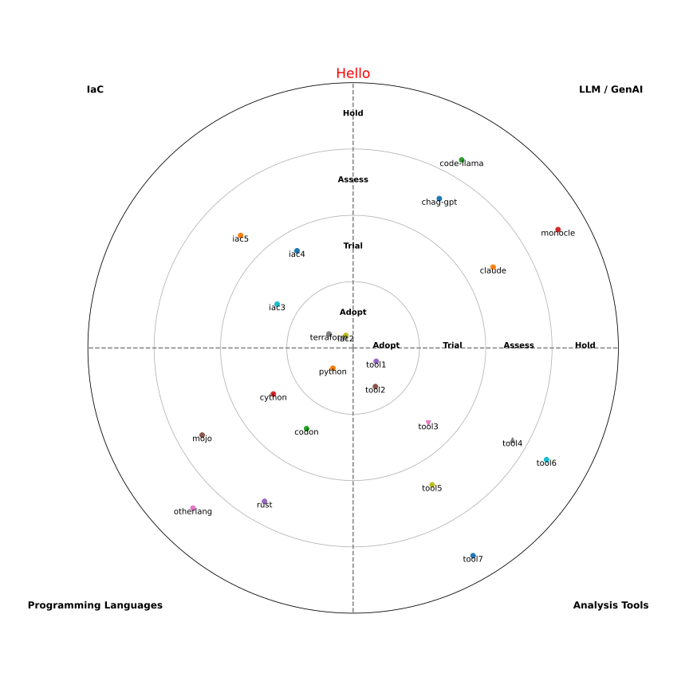

# tech_radar
Simplest Tech Radar creator in python

## Install

```bash
poetry shell
poetry install
```

## Use

Define the yaml:

```yaml
---
quadrants:
  - LLM / GenAI
  - Analysis Tools
  - Programming Languages
  - IaC

categories:
  - Adopt
  - Trial
  - Assess
  - Hold

technologies:
  LLM / GenAI:
    Adopt:
    Trial:
    Assess:
      - chag-gpt
      - claude
    Hold:
      - code-llama
      - monocle
```

Then run

```bash
tech-radar --input-yaml example.yml --output example.svg
```


